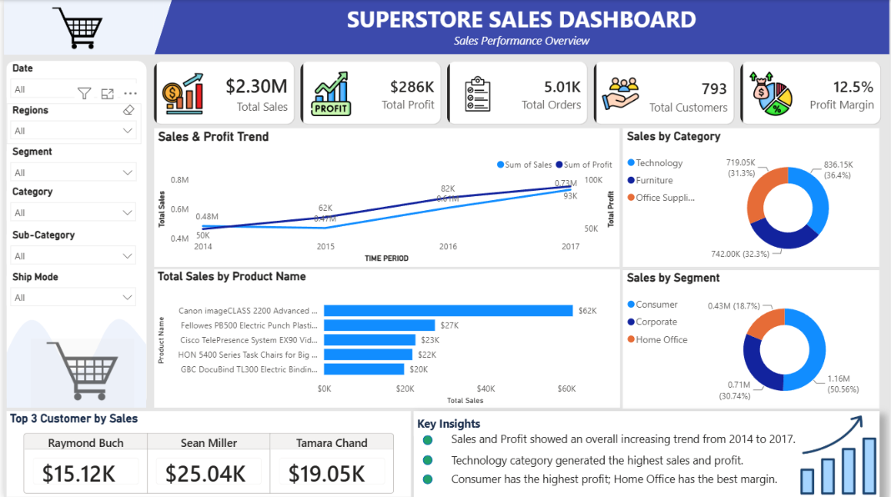
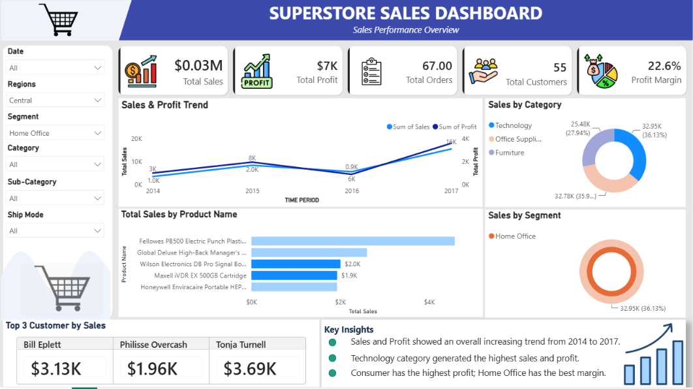

# Superstore Sales Dashboard

An interactive Power BI dashboard that I built to analyse sales performance for a retail superstore between 2014 and 2017. I wanted to go beyond just charting totals and find out where the business actually makes money and where it loses it.

Every visual responds to the slicers. Here is the same dashboard filtered to the Central region and the Home Office segment:

## What the dashboard shows

- **KPI cards:** total sales, total profit, total orders, total customers and profit margin
- **Sales and profit trend** by year
- **Sales by category** and **sales by segment**
- **Top 5 products** by sales
- **Top 3 customers** by sales
- **Slicers** for date, region, segment, category, sub-category and ship mode, so every visual can be filtered together

## Headline numbers

| Metric | Value |
|---|---|
| Total sales | $2.30M |
| Total profit | $286K |
| Orders | 5,009 |
| Customers | 793 |
| Profit margin | 12.5% |

## What I found

- **The business is growing.** Sales went from $484K in 2014 to $733K in 2017, and profit from $50K to $93K.
- **Technology is the strongest category.** It brings in the most sales ($836K) and the most profit ($145K), with a 17.4% margin.
- **Furniture is a problem.** Its sales ($742K) are close to Office Supplies, but the margin is only 2.5%, against 17% for Office Supplies.
- **Consumer is the biggest segment** (about 51% of sales, $134K profit), but it has the lowest margin at 11.5%. Home Office has the best margin at 14.0%.
- **The Central region lags.** Its margin is 7.9%, compared with 14.9% in the West.
- **Three sub-categories lose money:** Tables (-$17.7K), Bookcases (-$3.5K) and Supplies (-$1.2K).
- **Heavy discounting hurts.** Orders with no discount made $321K profit. Orders discounted by more than 20% lost about $135K in total.
- **Top customers by sales:** Sean Miller ($25.0K), Tamara Chand ($19.1K) and Raymond Buch ($15.1K).

## What I would recommend

1. Cap discounts at around 20%, since deeper discounts turn profitable sales into losses.
2. Review pricing and discount rules for Tables and Bookcases.
3. Look into costs and discounting in the Central region.
4. Keep investing in Technology, and protect the loyal high-value customers.

## Tools used

Power BI Desktop and DAX measures for the dashboard, and Excel to check and clean the data before loading it into Power BI.

## Dataset

The Sample Superstore dataset: 9,994 order lines covering orders, customers, products, discounts, sales and profit. I started from the CSV file, opened it in Excel to check the data and clean it, and then loaded it into Power BI.

## Files

- `superstore.pbix`: the Power BI report (open it with Power BI Desktop)
- `Data/`: the source data (`Sample - Superstore.csv` and `.xlsx`)
- `Images/`: dashboard screenshots, plus the icons used in the report (`Images/png`)
- `README.md`: this file

## How to open the project

1. Install [Power BI Desktop](https://powerbi.microsoft.com/desktop/) (it is free, Windows only).
2. Download or clone this repository.
3. Open `superstore.pbix`. If Power BI asks for the data source, point it to `Sample - Superstore.csv` in the `Data` folder.

## Ideas for the next version

- Add a map or bar chart to compare regions directly
- Add profit by sub-category so the loss-making products are visible on the dashboard
- Show year-over-year growth on the KPI cards
- Rank the top customers by sales instead of listing them alphabetically

## What I learned

Building this taught me how a high total profit can hide weak areas, like a low-margin category or a region that underperforms. Checking profit as well as sales is what turned the dashboard from a report into something a manager could act on.
